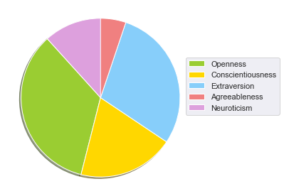
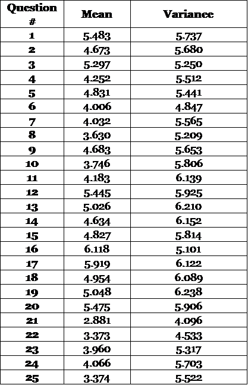
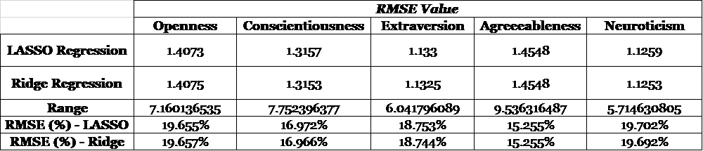
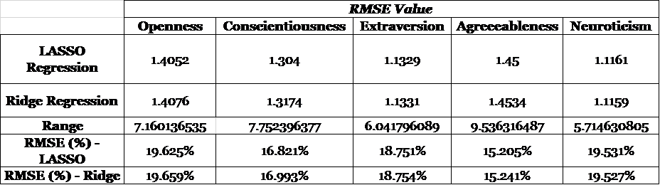
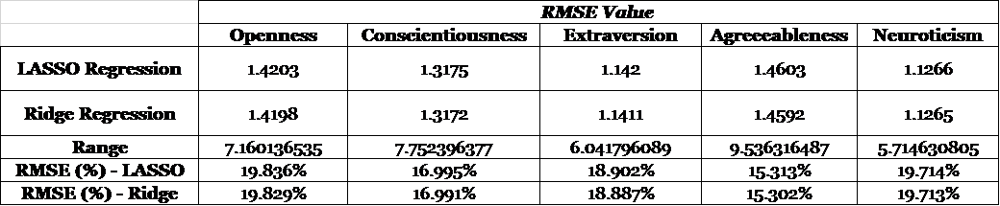
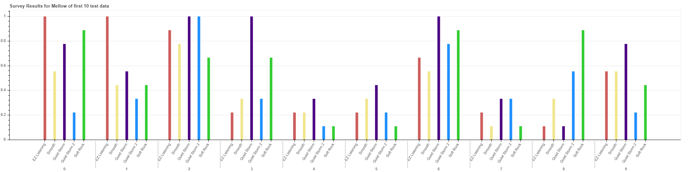
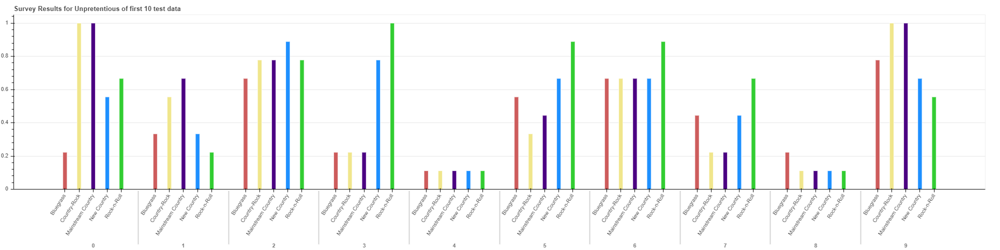
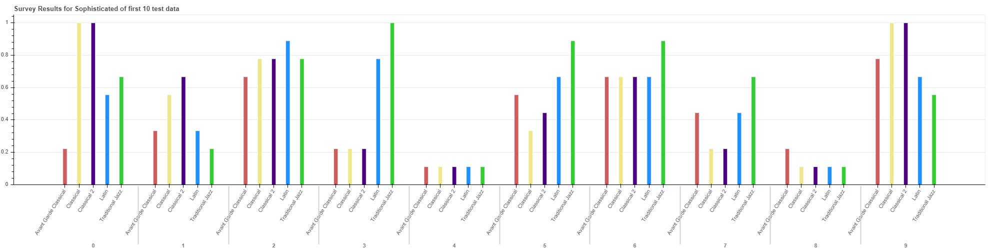
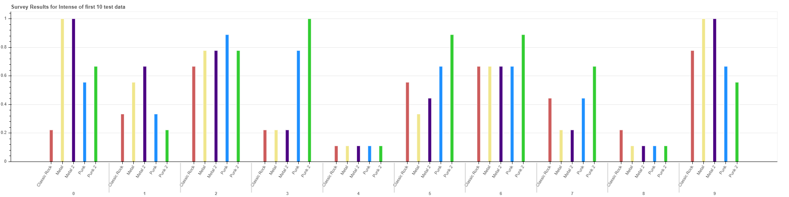
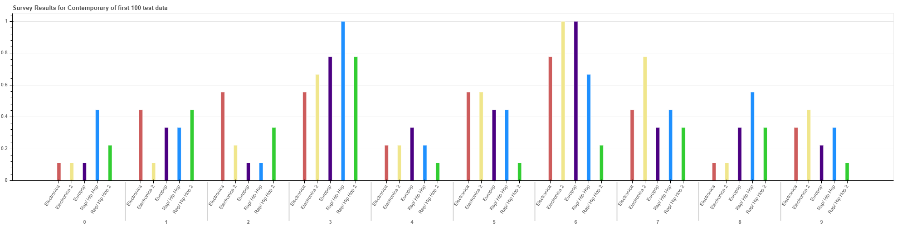

# Project Report on "Prediction of Personality Traits Based on Musical Preferences"
# 1. Introduction and Motivation
Music is one of the fundamental way people use to express their emotions and it is no secret that certain faction of people would prefer a certain type of music, whereas another faction would like some other type of music. Schafer and Sedlmeier explored and concluded that there are four main reasons people listen to music; social, emotional, self-related, and arousal-related [1]. Many researchers have tried to establish a relationship between personality type and choice of music and vice-versa. Catell was the first person to explore this topic and developed a list of 16 personality factor and based on the values of these factors during test predicted the personalities of individual [2]. Another attempt to develop personality assessment was done by McCrae and Costa in 1992, during which they used Eysenck Personality Inventory (EPI) and developed a five factors model to assess personality factors in a person [3]. These factors include extraversion, agreeableness, emotional stability conscientiousness and openness to experience. North, in 2008 established that a person’s preference for music is linked to his personality type [4]. In 2009, Nicola Sigg researched on the music preference and personality wellbeing, even though the research failed to establish relationship between music preference, social identity and self esteem yet the study showed a definite relationship between personality traits and music preference [5]. Furthermore, music is also described to have a calming effect on mind [6] and enhancing effect on mood of individual.  

The way people consume music has changed quite a bit over the past decades. In 2019, most of the music is consumed through internet based streaming services. 

More than 50 Million people in US alone use these streaming services and the overall size of music streaming services industry today in US is 4.3 Billion USD whereas 11 Billion USD worldwide [7]. As all these streaming services cater to personalized music choices, and since we have established that music choices depend upon the personality traits, so the enormous consumer base of this industry presents a bright prospect to predict the personality types of the consumers. The data on the personality type of individual on one hand can be used to provide an even more personalized music suggestion in the streaming service while on the other hand can be used by the streaming service/shared with the advertisement (platform) to generate more targeted advertisements based on the personality type of individual. The overall size of internet-based advertisement industry is 333 Billion USD and it is projected to further increase to 517 Billion USD by 2023. Even a minor increase in the accuracy of targeted advertisement from music preference can account for billions of revenues for the advertisement industry [8]. 

We plan to address this specific area by developing an algorithm that predicts the personality type of individuals based on music choice and then generalize our results so that they could be used to develop targeted ads. 

# 2. Data Sample
In order to develop our algorithm, we have used a public dataset in which a total of 23737 participants from various countries were involved [9,10]. Among these 23737 participants, 17904 also took a personality test, and from these 17904 people, only 8101 people also provided their age and gender information.

A total of 150 different musical excerpts were used for the test but the participant had to listen to 25 randomly selected 15 seconds long excerpts out of these 150. The participants were asked to rate their likeness to those excerpts from 1 (*Not at all*) to 9 (*Very Much*). Genres for these musical excerpts were already labelled in the data set. A total of 19 genres were used for testing which were grouped according to five-factor MUSIC model; __M__= Mellow, __U__= Unpretentious, __S__= Sophisticated, __I__= Intense, __C__= Contemporary [11]. According to [9], breakdown of grouping 19 genres into five categories is as follows:

Music Factor  |         Genres
------------- | ---------------------
Mellow    | EZ Listening, Smooth, Quiet Storm, Soft Rock
Unpretentiousness  | Bluegrass, Country- rock, Mainstream Country, New Country, Rock-n-Roll
Sophisticated     | Avant Garde Classical, Classical, Latin, Traditional Jazz      
Intense       |  Classic Rock, Metal, Punk                    
Contemporary  |  Electronica, Euro-pop, Rap/Hip-Hop               

Results of the personality test prticipants partook in analyzes Big Five personality traits; __O__= Openness, __C__= Conscientiousness, __E__= Extraversion, __A__= Agreeableness, __N__= Neuroticism and assigns a score for each trait from 1 (*low*)–5 (*high*).

Our main objective was to develop a model that can assess the music choices and based on that predict the personality traits score for the individual. 

Below are some plots to help visualize the data set:

#### Since our data set has N= 8101 data points, let's plot only the first 10 points of the normalized test data. 
- Below is the pie chart showing the average scores for each personality trait. 

- Below is the pie chart showing the distribution of the questions on the musical preferences test according to the genres and five-factor MUSIC model each question belongs to: 

First five questions of the music test contains music excerpts of genres EZ Listening, Smooth, Quiet Storm, Soft Rock all of which characterizes *Mellow* factor. Similarly, following 5 questions (questions 6-10) represent genres of Electronica, Euro-pop, Rap/Hip-Hop all of which characterizes *Contemporary* factor. Questions 11-15 consist of music excerpts from genres Avant Garde Classical, Classical, Latin, Traditional Jazz representing *Sophisticated* factor. Questions 16-20 have 1-2 music excerpts from Classic Rock, Metal, Punk genres, all of which belongs to *Intense*. Lastly, questions 21-25 have excerpts from Bluegrass, Country- rock, Mainstream Country, New Country, Rock-n-Roll genres to represent *Unpretentious* factor in the __MUSIC__ model.  

# 3. Methodology
### 3.1. Data Pre-processing
As explained in Section 2 (*Data Sample*) , among 17904 people who took both a personality test and the music preferences survey, only 8101 people also disclosed their age and gender information. In order to remain consistent across different studies used in our project, we decided to use the data belonging to these 8101 people (N = 8101). 90% of the data is used for training and the remaining 10% is used to validate the learning algorithm. Since the size of our data set is N = 8101, the last 810 data points are selected as the test data. 

Data is then normalized using the mean and variance values for each feature and labels of training data. Age and gender data are not normalized. Below are tables illustrating the mean and standard deviation values corresponding to survey results and labels:

Table 1 shows the mean and standard deviation values corresponding to scores of personality traits(i.e. labels).

Table 2 shows the mean and standard deviation values corresponding to responses to music preferences survey(i.e. 25 features).

Table 3 shows the mean and standard deviation values corresponding to average ratings of 5 factors in MUSIC model(i.e. 5 features).

Using these mean and variance values, data is then normalized according to the formula X_norm = (X-μ)/σ where X denotes the data, μ is the mean and σ is the variance of data.

### 3.2. Learning Method Selection
We randomly split our dataset into 10-folds, one for the test and 9 for the training. A linear model is trained by fitting the linear regressions with the LASSO and Ridge regularization, which help reduce the risk of overfitting issue. In order to get the best tuning parameter,  λ, we run a 10-fold cross-validation of training dataset and select the  λ parameter with the smallest root-mean-square-error (RMSE) as our  λ. With the trained model, we predict the labels for the test data and compare with the given labels. The accuracy the prediction is then evaluated by calculating the Pearson’s correlation coefficient between the real and predicted personality-traits. RMSE values for the prediction results are also calculated to provide a better insight on the performance of our algorithm.

# Study Results
To evaluate the performance of our algorithm, we ran three studies out of sample dataset. In the first study, survey results of all 25 questions are treated as features, i.e. *d = 25*. For the second study, age and gender information of participants are used as features along with survey responses to 25 questions, i.e. *d= 27*. Lastly, survey responses are grouped according to five-factor MUSIC model, where each five questions represents *Mellow, Contemporary, Sophisticated, Intense and Unpretentious*, respectively. In each MUSIC category, results were averaged such that number of features are reduced to 5. In each study, labels are selected to be the individual scores for each Big-Five personality traits (O, C, E, A, N). For each study, we ran the prediction on each label (i.e. score for one personality trait) individually to increase the performance of our prediction algorithm.

To compare the prediction results of each study, Pearson's correlation coefficient and confidence intervals are calculated and compared with those values provided [9]. Furthermore, root mean squared error (RMSE) is calculated for each study. Below are the performance results for each study:

Table 4 summarizes the results correponding to the study 1 in which 25 features are used for prediction.

RMSE values are given in Table 5. RMSE values are scaled with the range of test data to present the percentage RMSE as well.

Table 6 summarizes the results correponding to the study 2 in which 27 features are used for prediction.

RMSE values are given in Table 7.

Table 8 summarizes the results correponding to the study 3 in which 5 features are used for prediction.

RMSE values are given in Table 9.

# Conclusion
Study results indicate running our algorithm with LASSO vs. Ridge regression provides comparable performance results with the results provided in [9]. Different from the work presented in [9], we reduced the dimension of the features significantly by averaging the ratings given to each MUSIC category. Results in Table 8 and 9 show that even though the significantly less features are used for prediction, our LASSO and Ridge algorithm can successfully predict the scores of the personality traits. 

With the ever burgeoning music and streaming industry, the amount of data will continue to increase and inorder to provide a better user experience it would become more and more relevant to reduce the processing times and processing power for such predictive algorithms. Our study successfully reduced the number of parameters for the same without compromising on the quality and performance of algorithm, hence it can be generalized.

# Bibliography
[1] 	T. Shafer and D. Huron, "The Psychological Function of Music Listening," Frontiers in Psychology, 2013. 

[2] 	R. B. Catell and J. C. Anderson, "The measurement of personality and behavior disorders by the I. P. A. T. Music Preference Test," Journal of Applied Psychology, 1953. 

[3] 	R. R. McCrae and P. J. Oliver, "An Introduction to the Five‐Factor Model and Its Applications," Journal of Personality, vol. 60, no. 2, pp. 175 - 215, 1992. 

[4] 	A. North, L. Desborough and L. Skarstein, "Musical Preference, deviance, and attitudes towards music celebrities.," Personality and Individual Differences, vol. 38, pp. 1903 - 1914, 2005. 

[5] 	N. Sigg, "An investigation into the relationship between music preference, personality and Psychological Well-being," Auckland University of Technology , Auckland, Newzealand, 2009.

[6] 	J. Steele and J. D. Brown, "Adolescent room culture: Studying media in the context of everyday life," Journal of Youth and Adolescence, vol. 24, no. 5, pp. 551 - 576, 1995. 

[7] 	Statista Corporation, "Music Streaming Statista," Statista, 2019. [Online]. Available: https://www.statista.com/outlook/209/100/music-streaming/worldwide. [Accessed 15 July 2019].

[8] 	Jasmine Enberg, "Digital Ad Spending 2019," eMarketer, 28 March 2019. [Online]. Available: https://www.emarketer.com/content/global-digital-ad-spending-2019. [Accessed 15 July 2019].

[9] G. Nave, J. Minxha, D. M. Greenberg, M. Kosinski, D. Stillwell, J. Rentfrow, "Musical Preferences Predict Personality: Evidence From Active Listening and Facebook Likes," Psychological Science, Vol. 29(7), pg. 1145 –1158, 2018. DOI: 10.1177/0956797618761659. 

[10] Datasets obtained at https://osf.io/nfqb9/?view_only=dff0271c8e0049bc88738e5a7b51ec2f.

[11] P.J. Rentfrow, L.R. Goldberg, D.J. Levitin, "The Structure of Musical Preferences: A Five-Factor Model," Journal of Personality and Social Psychology, Vol. 100, No. 6, pg. 1139–1157, 2011.

# Presentation
## Our Data:
- Total number of data points: N=23737
- Number of people who also took a personality test: N=17904, among which only 8101 people disclosed their age and gender information.
- 90% (N_training = 7291) of the data is used for training and the remaining 10% (N_test = 810) is used to validate the learning algorithm.
- Data normalized using the mean and variance of training data.
- Music excerpts used in the survey are 25 seconds long and consists of 19 different genres. Below is the breakdown of the survey questions:

- Based on how much participants like each song excerpt, each questions is rated with a score from 1 (*Not at all*) to 9 (*Very Much*).

- Below is the pie chart showing the distribution of the questions on the musical preferences survey according to the genres and five-factor MUSIC model each question belongs to: 

- The Big-Five personality test contains scores of 1 (*low*) to 5 (*high*) for 5 different personality traits; __O__= Openness, __C__= Conscientiousness, __E__= Extraversion, __A__= Agreeableness, __N__= Neuroticism.

- Below is the pie chart showing the average scores for each personality trait for the first 10 points of the normalized test data: 

### Survey Results of the first 10 test data points grouped into MUSIC Factors:

## Study Results:
Three studies with different number of features are conducted to evaluate the performance of the prediction algorithm:
- Study 1: based on survey results only (25 features)
- Study 2: based on survey results + gender + age (27 features)
- Study 3: based on average of survey results grouped into 5 MUSIC factors (5 features)

### RMSE values of Study 1: 

RMSE values are scaled with the range of test data to present the percentage RMSE as well.

### RMSE values of Study 2: 

RMSE values are scaled with the range of test data to present the percentage RMSE as well.

### RMSE values of Study 3: 

RMSE values are scaled with the range of test data to present the percentage RMSE as well.
